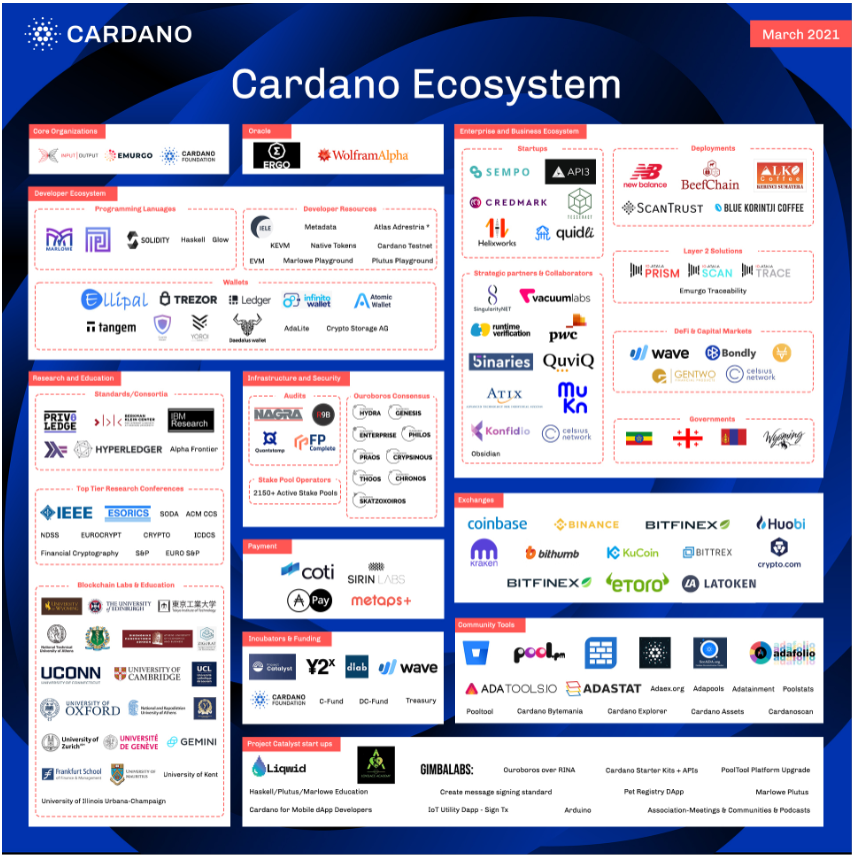

# The essential Cardano list #

The essential Cardano list provides an outline and accompanying map of the Cardano ecosystem on this page and a central library of materials on the [Essential Resources page](https://github.com/input-output-hk/essential-cardano/blob/main/resources.md#essential-resources), which includes official IOG, Cardano Foundation, and Emurgo resources, as well as community-generated materials. 

This list is fully open source so we hope that you can help us to grow and fine tune our recommendations to make our list even better. We encourage you to let us know of new content that is being produced by the community, new relationships, new innovations, so that we can add them all to this list and build out the ecosystem. 

Here is an outline of the categories:
- [Navigate the Cardano Ecosystem](https://github.com/input-output-hk/essential-cardano/blob/main/essential-cardano-list.md#navigate-the-cardano-ecosystem)
- [Core Organizations](https://github.com/input-output-hk/essential-cardano/blob/main/essential-cardano-list.md#core-organizations)
- [Oracles](https://github.com/input-output-hk/essential-cardano/blob/main/essential-cardano-list.md#oracles)
- [Enterprise & Business Ecosystem](https://github.com/input-output-hk/essential-cardano/blob/main/essential-cardano-list.md#enterprise--business-ecosystem)
- [Startups](https://github.com/input-output-hk/essential-cardano/blob/main/essential-cardano-list.md#startups)
- [Strategic Partners and Collaborators](https://github.com/input-output-hk/essential-cardano/blob/main/essential-cardano-list.md#strategic-partners-and-collaborators)
- [Layer 2 Solutions](https://github.com/input-output-hk/essential-cardano/blob/main/essential-cardano-list.md#layer-2-solutions)
- [Deployments](https://github.com/input-output-hk/essential-cardano/blob/main/essential-cardano-list.md#deployments)
- [DeFi and Capital Markets](https://github.com/input-output-hk/essential-cardano/blob/main/essential-cardano-list.md#defi-and-capital-markets)
- [Governments](https://github.com/input-output-hk/essential-cardano/blob/main/essential-cardano-list.md#governments)
- [Exchanges](https://github.com/input-output-hk/essential-cardano/blob/main/essential-cardano-list.md#exchanges)
- [Incubators and Funding](https://github.com/input-output-hk/essential-cardano/blob/main/essential-cardano-list.md#incubators-and-funding)
- [Developer Ecosystem](https://github.com/input-output-hk/essential-cardano/blob/main/essential-cardano-list.md#developer-ecosystem)
- [Programming Languages](https://github.com/input-output-hk/essential-cardano/blob/main/essential-cardano-list.md#programming-languages)
- [Developer Resources](https://github.com/input-output-hk/essential-cardano/blob/main/essential-cardano-list.md#developer-resources)
- [Wallets](https://github.com/input-output-hk/essential-cardano/blob/main/essential-cardano-list.md#wallets)
- [Research and Education](https://github.com/input-output-hk/essential-cardano/blob/main/essential-cardano-list.md#research-and-education)
- [Standards/Consortia](https://github.com/input-output-hk/essential-cardano/blob/main/essential-cardano-list.md#standardsconsortia)
- [Top Tier Research Conferences](https://github.com/input-output-hk/essential-cardano/blob/main/essential-cardano-list.md#top-tier-research-conferences)
- [Blockchain Labs and Education Instiutions](https://github.com/input-output-hk/essential-cardano/blob/main/essential-cardano-list.md#blockchain-labs-and-education-institutions)
- [Payments](https://github.com/input-output-hk/essential-cardano/blob/main/essential-cardano-list.md#payments)
- [Infrastructure & Security](https://github.com/input-output-hk/essential-cardano/blob/main/essential-cardano-list.md#infrastructure--security)
- [Project Catalyst Startups](https://github.com/nahern/essential-cardano/blob/main/essential-cardano-list.md#project-catalyst-startups)
- [Exploring Stake Pools](https://github.com/input-output-hk/essential-cardano/blob/main/essential-cardano-list.md#exploring-stake-pools)
- [Stake Pool 0perators](https://github.com/input-output-hk/essential-cardano/blob/main/essential-cardano-list.md#-stake-pool-operators-)
- [Ada Calculators](https://github.com/input-output-hk/essential-cardano/blob/main/essential-cardano-list.md#ada-calculators)
- [Other IOHK Solutions](https://github.com/input-output-hk/essential-cardano/blob/main/essential-cardano-list.md#other-iohk-solutions)
- [Essential Resources](https://github.com/input-output-hk/essential-cardano/blob/main/resources.md#essential-resources)

## Navigate the Cardano Ecosystem ##
Here is a map of our vibrant ecosystem (April 2021): 

## Core Organizations ##
- [IOHK](https://iohk.io/en/)
- [Cardano Foundation](https://cardanofoundation.org/)
- [Emurgo](https://emurgo.io/)

## Oracles ##
- [Ergo](https://ergoplatform.org/en/)
- [WolframAlpha](https://www.wolframalpha.com/)

## Enterprise & Business Ecosystem ##

### Startups ###
- [API3](https://api3.org/)
- [Credmark](https://credmark.com/)
- [Helixworks](https://helix.works/)
- [Sempo](https://withsempo.com/)
- [Tesseract](https://tesseract.one/)
- [Quidli](https://quid.li/)

### Strategic Partners and Collaborators ###
- [SingularityNET](https://singularitynet.io/)
- [Mukn](https://mukn.io/)
- [Obsidian](https://obsidian.systems/blockchain)
- [Vacuumlabs](https://vacuumlabs.com/)
- [QuiviQ](http://quviq.com/)
- [Atix](https://www.atixlabs.com/)
- [Konfidio](https://konfidio.com/)
- [FiveBinaries](https://fivebinaries.com/)
- [Runtime Verification](https://runtimeverification.com/)
- [PWC](https://www.pwc.com/)
- [Orion](https://blog.orionprotocol.io/)
- [Celsius Network](https://celsius.network/)
- Scalac
- [Tweag](https://www.tweag.io/)
- [Well Typed](https://www.well-typed.com/)
- Ncube
- Bloxico
- LunaTech
- Bairesdev
- Alt Labs
- Eleks
- Node Factory
- Metalamp
- Dquadrant
- Mlabs
- BinarApps

### Layer 2 Solutions ###
- [IOHK Atala Prism](https://www.atalaprism.io/)
- [IOHK Atala Trace](https://iohk.io/enterprise/)
- [IOHK Atala Scan](https://iohk.io/enterprise/)
- [EMURGO Traceability](https://emurgo.io/our-products#emurgo-traceability)

### Deployments ###
- [New Balance](https://www.newbalance.com/)
- [BeefChain](https://beefchain.com/)
- [Scantrust](https://www.scantrust.com/)
- [Blue Korintji Coffee](https://www.bluekorintji.com/)
- Alko Coffee

### DeFi and Capital Markets ###
- [Celsius](https://celsius.network/)
- [Bondly](https://bondly.finance/)
- [Wave](https://wavegp.com/)
- [Generation Two Securitization](https://www.gentwo.com/)
- [Venus](https://venus.io/)

### Governments ###
- [Ethiopia](https://pmo.gov.et/)
- [Wyoming](http://www.wyo.gov/)
- [Georgia](http://gov.ge/index.php?lang_id=ENG)
- Mongolia

### Exchanges ###
- [Coinbase](https://www.coinbase.com)
- [Binance](https://www.binance.com/en)
- [Kraken](https://www.kraken.com/)
- [Bittrex](https://global.bittrex.com/)
- [Huobi](https://www.huobi.com/)
- [Kucoin](https://www.kucoin.com/)
- [Bitthumb](https://en.bithumb.com/)
- [Bitfinex](https://www.bitfinex.com/)
- [Crypto.com](https://crypto.com/)
- [Etoro](https://www.etoro.com/)
- [LATOKEN](https://latoken.com/)

### Incubators and Funding ###
- [Project Catalyst](https://cardano.ideascale.com/a/index)
- [Y2X](https://y2x.io/)
- [Dlab](https://dlab.vc/)
- DC-fund
- C-fund
- Treasury Wave  

## Developer Ecosystem ##
Here is an outline of the developer ecosystem and relevant resources to help you learn how to build on Cardano.

### Programming Languages ###

#### Haskell ####
- [Haskell](https://www.haskell.org/)
- [Learn You a Haskell guide](http://learnyouahaskell.com/)

#### Marlowe ####
- [Marlowe explainer](https://docs.cardano.org/en/latest/marlowe/marlowe-explainer.html)
- [Marlowe Playground](https://alpha.marlowe.iohkdev.io/#/)
- [Marlowe tutorial](https://alpha.marlowe.iohkdev.io/tutorial/index.html)
- [Marlowe in Cardano explained](https://www.youtube.com/watch?v=S41GIRl0kVY)
- [Marlowe Official Telegram](https://t.me/IOHK_Marlowe)
- [Marlowe Udemy course (v. 1)](https://www.udemy.com/course/marlowe-programming-language/) (for background reading only, the development environment has changed. Version 2 will be out soon.)

#### Plutus ####
- [Plutus overview](https://developers.cardano.org/en/programming-languages/plutus/overview/)
- [Plutus Playground](https://playground.plutus.iohkdev.io/)
- [Plutus tutorials](https://playground.plutus.iohkdev.io/tutorial/tutorials/index.html)
- [Plutus community documentation](http://docs.plutus-community.com/)
- [Plutus ebook](https://www.amazon.co.uk/Plutus-Writing-reliable-smart-contracts-ebook/dp/B07V46LWTW) (for background reading only, the development has changed. Version 2 will be out soon)
- [Plutus Udemy course (v. 1)](https://www.udemy.com/course/plutus-reliable-smart-contracts/) (for background reading only, the development environment has changed. Version 2 will be out soon)

##### ⚔️ Plutus Pioneers ⚔️ #####
These materials have been produced by the Plutus Pioneer course participants:
- [Plutus Community Documentation GitBook](https://docs.plutus-community.com/?utm_source=Developers&utm_campaign=4f9ab1c222-EMAIL_CAMPAIGN_2021_03_31_06_14_COPY_01&utm_medium=email&utm_term=0_c9c99d4ad3-4f9ab1c222-77569945)
- [Overview of Lecture 1](https://www.youtube.com/watch?v=Cdu0gzCiYbY)
- [Installing the Plutus Playground](https://bikemonkey.tech/ppp-install-the-plutus-playground-on-macos-big-sur/?utm_source=Developers&utm_campaign=4f9ab1c222-EMAIL_CAMPAIGN_2021_03_31_06_14_COPY_01&utm_medium=email&utm_term=0_c9c99d4ad3-4f9ab1c222-77569945)
- [Setting up the Plutus Playground in a Docker container](https://github.com/heathdrobertson/plutus-pioneer?utm_source=Developers&utm_campaign=4f9ab1c222-EMAIL_CAMPAIGN_2021_03_31_06_14_COPY_01&utm_medium=email&utm_term=0_c9c99d4ad3-4f9ab1c222-77569945)
- [How to get the Plutus Playground up and running](https://tutorials.cardanoacademy.io/?utm_source=Developers&utm_campaign=4f9ab1c222-EMAIL_CAMPAIGN_2021_03_31_06_14_COPY_01&utm_medium=email&utm_term=0_c9c99d4ad3-4f9ab1c222-77569945)
- [Awesome Plutus](https://github.com/juanscolari/awesome-plutus?utm_source=Developers&utm_campaign=05d80006c7-EMAIL_CAMPAIGN_2021_03_31_06_14_COPY_01&utm_medium=email&utm_term=0_c9c99d4ad3-05d80006c7-77569945)

#### Glow ####
- [Glow offical website](https://glow-lang.org/)
- [Glow official docs](https://glow-lang.org/docs/)
- [Glow tutorial](https://developers.cardano.org/en/programming-languages/glow/getting-started/glow-tutorial/)

### Developer Resources ###
- [Cardano testnet](https://developers.cardano.org/en/testnets/cardano/overview/)
- [IELE](https://runtimeverification.com/the-iele-virtual-machine/)https://runtimeverification.com/the-iele-virtual-machine/
- Metadata
- Atlas Adrestia
- [EVM](https://developers.cardano.org/en/virtual-machines/evm/overview/)
- [KEVM](https://developers.cardano.org/en/virtual-machines/kevm/overview/)

### Native Tokens ###
- [Native tokens explainer](https://docs.cardano.org/en/latest/native-tokens/learn-about-native-tokens.html)
- [Native tokens explainer video](https://www.youtube.com/watch?v=PVqsCXh-V5Y)

## Wallets ##
- [Daedalus](https://daedaluswallet.io/)
- [Yoroi](https://yoroi-wallet.com/#/)
- [Trezor](https://trezor.io/)
- [Infinito wallet](https://www.infinitowallet.io/)
- [Ledger](https://www.ledger.com/)
- [Adalite](https://adalite.io/)
- [Atomic wallet](https://atomicwallet.io/)
- [Tangem](https://tangem.com/apps/)
- [Ellipal](https://www.ellipal.com/)
- [Crypto Storage AG](https://www.cryptofinance.ch/en/storage/)
- [Medusa Adawallet](https://adawallet.io/)
- [Revolut](https://www.revolut.com/)
- [Guarda Wallet](https://guarda.com/)

## Research and Education ##

### Standards/Consortia ###
- [Hyperledger](Hyperledger)
- Alpha Frontier
- [Berkman Klein Center](https://cyber.harvard.edu/)
- [IBM Research](https://www.research.ibm.com/)
- [Priveledge](https://priviledge-project.eu/about)

### Top Tier Research Conferences ###
- [ACM Sigsac](https://www.sigsac.org/)
- [IEEE](https://www.ieee.org/)
- [NDSS](https://www.ndss-symposium.org/)
- [Soda](https://dl.acm.org/conference/soda)
- [Esorics](http://conf.laas.fr/esorics/)
- [Eurocrypt](https://eurocrypt.iacr.org/2021/)
- [Euro S&P](http://www.ieee-security.org/TC/EuroSP2021/)
- [Crypto](https://crypto.iacr.org/2021/)
- [S&P](https://www.ieee-security.org/TC/SP2021/cfpapers.html)
- [ICDCS](https://icdcs2021.us/)
- [Financial Cryptography](https://fc21.ifca.ai/index.php)

### Blockchain Labs and Education Institutions ###
- [The University of Edinburgh](https://www.ed.ac.uk/)
- [University of Wyoming](http://www.uwyo.edu/)
- [University of Kent](https://www.kent.ac.uk/)
- [University of Cambridge](https://www.cam.ac.uk/)
- [University of Illinois Urbana-Champaign](https://illinois.edu/)
- [Tokyo Institute of Technology](https://www.titech.ac.jp)
- [National Technical University Of Athens](https://www.ntua.gr)
- [Athens University of Economics and Business](https://www.aueb.gr)
- [UCL](https://www.ucl.ac.uk/)
- [KHARKIV National Medical University](http://www.knmu.kharkov.ua/index.php)
- [UCONN](https://uconn.edu/)
- [University of Oxford](https://www.ox.ac.uk/)
- [Zhejiang University](https://www.zju.edu.cn)
- [University of Zurich](https://www.uzh.ch)
- [University of Geneva](https://www.unige.ch/)
- [Zigurat Global Institute of Technology](https://www.e-zigurat.com)
- [Frankfurt Business School](https://www.frankfurt-school.deitis]())
- [University of Mauritius](https://www.uom.ac.mu/)
- [Gemini Cryptopedia](https://www.gemini.com/cryptopedia)

## Payments ##
- [Coti](coti.io)
- [Sirin Labs](https://sirinlabs.com/)
- [Metaps+](https://metaps.com/)
- AdaPay
- [Simplex](https://www.simplex.com/)

## Infrastructure & Security ##

### Audits ###
- [Quantstamp](https://quantstamp.com/)
- [FP Complete](https://www.fpcomplete.com/)
- [R9B](https://www.cybersecurityintelligence.com/root9b-r9b-6089.html)
- Nagra

### Ouroboros Consensus ###
- [Classic](https://iohk.io/en/research/library/papers/ouroborosa-provably-secure-proof-of-stake-blockchain-protocol/)
- [BFT](https://iohk.io/en/research/library/papers/ouroboros-bfta-simple-byzantine-fault-tolerant-consensus-protocol/)
- [Genesis](https://iohk.io/en/research/library/papers/ouroboros-genesiscomposable-proof-of-stake-blockchains-with-dynamic-availability/)
- [Praos](https://iohk.io/en/research/library/papers/ouroboros-praosan-adaptively-securesemi-synchronous-proof-of-stake-protocol/)
- [Hydra](https://eprint.iacr.org/2020/299.pdf)
- Chronos
- Crypsinous

## Project Catalyst Startups ##
- [Liqwid: Cardano DeFi Lending Markets](https://www.liqwid.finance/)
- [Cardano Starter Kits + APIs (Gimbalabs)](https://gimbalabs.com/)
- [PoolTool Platform Upgrade](http://ideascale.com/t/UM5UZBalo)
- [Lovelace Academy Marlowe Plutus](http://ideascale.com/t/UM5UZBanB)
- [Haskell/Plutus/Marlowe Education](http://ideascale.com/t/UM5UZBak5)
- [Ouroboros over RINA](http://ideascale.com/t/UM5UZBbCm)
- [Create message signing standard](http://ideascale.com/t/UM5UZBa0q)
- [Pet Registry dApp + ₳Pay API](http://ideascale.com/t/UM5UZBbDe)
- [Cardano for Mobile dApp Developers](http://ideascale.com/t/UM5UZBbD9)
- [IoT Utility Dapp - Sign Tx Arduino](http://ideascale.com/t/UM5UZBbJq)
- [Japan Cardano Governance Association-Meetings & Communities & Podcasts](http://ideascale.com/t/UM5UZBa7J)
- [Liqwid:Cardano DeFi Liquidity Pools](https://cardano.ideascale.com/a/dtd/333395-48088)
- [Ada Tx to Trigger IoT + IO HW Spins](https://cardano.ideascale.com/a/dtd/334417-48088)
- [Comprehensive NFT Framework Collab](https://cardano.ideascale.com/a/dtd/334521-48088)
- [Digital Asset Inheritance](https://cardano.ideascale.com/a/dtd/333096-48088)
- [Decentralized Accounting <- IFRS](https://cardano.ideascale.com/a/dtd/333447-48088)
- [Food traceability solution - Africa](https://cardano.ideascale.com/a/dtd/334507-48088)
- [Dapp for business contracts](https://cardano.ideascale.com/a/dtd/333905-48088)
- [The Basket DApp - 売買カート](https://cardano.ideascale.com/a/dtd/333127-48088)
- [Python module](https://cardano.ideascale.com/a/dtd/333770-48088)
- [Visual Studio Smart Contract Plugin](https://cardano.ideascale.com/a/dtd/333827-48088)
- [Liqwid Developer Portal:Cardano SDK](https://cardano.ideascale.com/a/dtd/333382-48088)
- [CardanoSharp - .NET Library](https://cardano.ideascale.com/a/dtd/333629-48088)
- [Developer & SPO Tools [CNTools]](https://cardano.ideascale.com/a/dtd/333605-48088)
- [Cardano IntelliJ IDEA Plugin (MVP)](https://cardano.ideascale.com/a/dtd/333570-48088)
- [Cardano serialization library in Go](https://cardano.ideascale.com/a/dtd/334110-48088)
- [Metadata oracle node](https://cardano.ideascale.com/a/dtd/334228-48088)
- [ABCD](https://cardano.ideascale.com/a/dtd/333467-48088)
- [ADA MakerSpace - DEV lessons](https://cardano.ideascale.com/a/dtd/334235-48088)
- [Metadata oracles explorer](https://cardano.ideascale.com/a/dtd/334106-48088)
- [Write Dapps as continuous workflows](https://cardano.ideascale.com/a/dtd/333838-48088)
- [Grow Africa, Grow Cardano](https://cardano.ideascale.com/a/dtd/333079-48088)
- [Scale-UP Cardano's DeFi Ecosystem](https://cardano.ideascale.com/a/dtd/333399-48088)
- [Address Gap in SPO Education/Comms](https://cardano.ideascale.com/a/dtd/323251-48088)

## Exploring Stake Pools ##
IOHK has developed a [stake pool metadata aggregation server (SMASH)](https://docs.cardano.org/en/latest/getting-started/stake-pool-operators/SMASH-metadata-management.html) to provide the community with a list of verified stake pools with valid metadata. Smash is integrated with the Daedalus wallet, and users can see a list of valid stake pools in the delegation center tab. 

You can also explore stake pools using these tools:
- [Cardano PoolTool](https://pooltool.io/)
- [ADAtainment](https://www.adatainment.com/index.php?page=home&lang=en)
- [POOLSTATS](https://poolstats.org/#)
- [Adatools (pools)](https://adatools.io/pools)
- [Ada pools](https://adapools.org/)
- [Cardanoscan (pools)](https://cardanoscan.io/pools)
- [List of stake pools (unofficial)](https://forum.cardano.org/t/list-of-cardano-ada-staking-pools-unofficial/7595)

## 🥁 Stake Pool Operators 🥁 ##
Here is a list of active stake pool operators:
- [Alliance](https://alliancestakepools.online/)
- [Queen Ada](https://alliancestakepools.online/)
- [Kiwi](https://www.kiwipool.org/)

## Ada Calculators ##
- [ada calculator](https://adacalculator.com/)

## Other IOHK Solutions ##
- [Mantis](https://mantisclient.io/)
